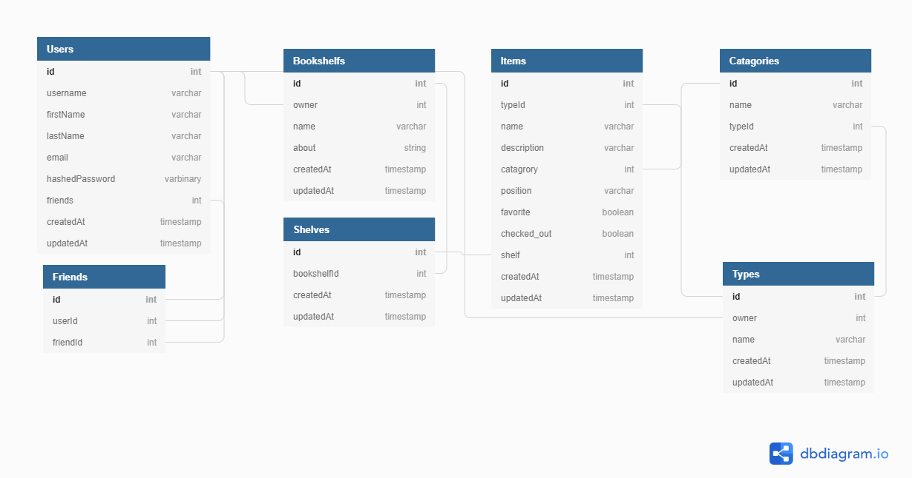

# ShelfWise

## MVPS (in order of completion)
1. User Auth CRUD
2. Bookshelf CRUD
3. Shelves CRUD
4. create items and add/remove from shelf
5. search for items

### Stretch Goals
1. user defined terms for catagories
2. Filter search based on different terms (artist, catagory, favorited, etc...) 
3. create "lists" to share with others in link form 
4. add friends to be able to co-edit bookshelves
5. add collections

---

## Database Design

---

## Wireframes

[Homepage](https://wireframe.cc/9LXqel)

[Bookshelf View](https://wireframe.cc/OOVsG2)

[Shelf View](https://wireframe.cc/ih2Fdp)

[Item View](https://wireframe.cc/hsGiM3)

[Collection View](https://wireframe.cc/l6jWQC)

## Routes
---
### Backend
---
#### User
| Route                          | Methods                 | Purpose |
| ------------------------------ | ------------------------| ------- |
| /api/register                  | POST                    | User account creation |
| /api/user/:id                  | GET, PUT, DELETE        | Get, edit, or delete User account information |
| /api/user/:id/bookshelf        | GET                     | Get bookshelves associated with the User |
| /api/user/:id/items            | GET                     | Get items associated with the User |
| /api//user/search/:searchTerm  | GET                     | Get item based on search       |
--- 
#### Bookshelf
| Route                          | Methods                 | Purpose |
| ------------------------------ | ------------------------| ------- |
| /api/bookshelf/create          | POST                    | Bookshelf creation |
| /api/bookshelf/:id             | GET, PUT, DELETE        | Get, edit, or delete Bookshelf information |
| /api/bookshelf/shelf/create    | POST                    | Shelf creation |
| /api/bookshelf/shelf/:id       | GET                     | Get, edit, or delete Shelf information |
| /api/bookshelf/shelf/item/create| POST                    | Item creation |
| /api/bookshelf/shelf/item/:id  | GET, PUT, DELETE        | Get, edit, or delete Item information |
---

---
### Frontend
---
| Route                          | Methods                 | Purpose |
| ------------------------------ | ------------------------| ------- |
| /                              | GET                     | Display bookshelves and currently checkout out items|
| /login                         | POST                    | Login Functionality|
| /register                      | POST                    | Registration functionality|
| /user/:bookshelf               | GET                     | View bookshelf page|
| /user/:bookshelf/shelf/:shelfId| GET                     | View shelf page    |
| /user/:bookshelf/shelf/:shelfId/:itemId| GET             | View item page     |
| /bookshelf/create              | POST                    | Create new bookshelf|
| /shelf/create                  | POST                    | Create new shelf   |
| /item/create                   | POST                    | Create new item    |

